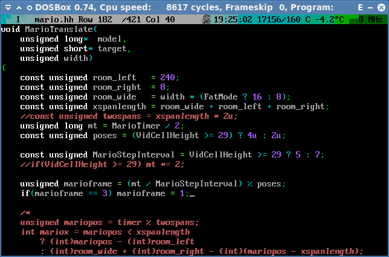
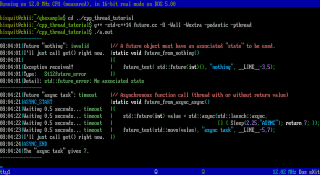
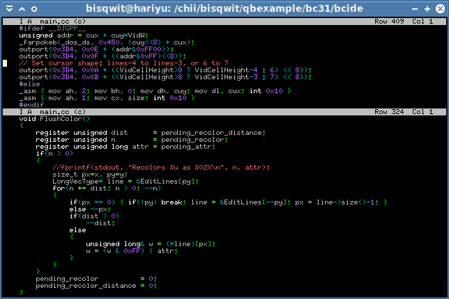
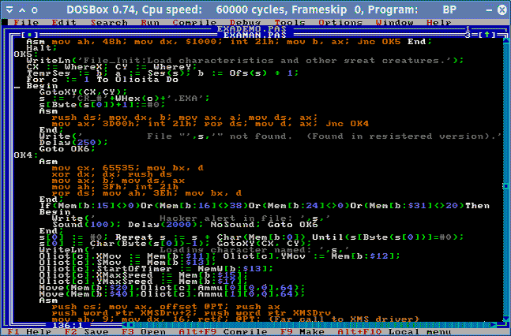
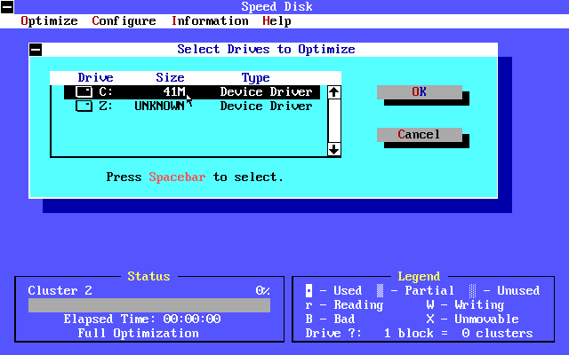

# That editor

It’s *that* editor.

Some more information at: https://github.com/bisqwit/compiler_series/tree/master/ep1/dostools

## What

It is a programming editor for DOS environments. More specifically, it is
something that *looks* like a programming editor for DOS environments.

Provided strictly AS-IS, with a mild warning that you really do not want to
use this editor. Seriously. It won’t do you any good.
Get a *real editor* (https://joe-editor.sourceforge.io/) instead.
You can get it to look pretty much identical,
and if you want a window sitter to go with it, get e.g.
[MaCoPiX](http://rosegray.sakura.ne.jp/macopix/index-e.html).

## Why does it exist

I am a video producer at YouTube. I make programming videos
featuring diverse topics from snake games to 3D engines.

I normally use [Joe](https://joe-editor.sourceforge.io/)
for all my editing purposes — whether programming or otherwise.

My editor was written only because Joe could not be compiled for DOS.
I used DOSBox only because I had too slow hardware to do desktop recording
in real time, and DOSBox contains a full-featured simulated environment
with a built-in recorder that works regardless of host system speed.

There *were* other syntax-coloring editors for DOS, and I actually
wanted to and *did* use Borland C++ 3.1 IDE for some of my earlier
videos.

But then I wanted to make a video with wider screen,
and despite my best efforts, I could not binary-patch Borland C++
to perfectly cooperate with screens that have other width
than 80 characters.
So I was cornered and had no choice but to make my own editor.
I could no longer remember how to use Turbo Vision,
and I couldn’t bother to study, so I wrote the editor entirely from scratch.

## Why 16-bit DOS

I wrote the editor for *16-bit* DOS because I thought there would
be significant troubles trying to mix 16-bit interrupt callbacks with
32-bit protected-mode code. Also I don’t think I knew back then,
that DJGPP has been as modernized as it indeed has. If it even was.
So I used Borland C++ 3.1.

This compiler by Borland was created before C++ was standardized, and it required
me to make many sacrifices about style / sanity in the source code.
For example, it did not support namespaces or templates. No STL!
As such, the code is not representative of good programming practices
for C++ programming, not by a long shot.

Incidentally, because it’s 16-bit, it also has serious memory limits
and other bugs associated with it.
*Eventually* this *forced* me to port it for 32-bit DJGPP despite my initial fears.
I completed this port on 2018-01-12 in just a couple of hours
(huh, maybe the coding style was not *that* bad after all).
It can be found in the 32bit directory.
Note that despite this DJGPP port being compiled on very modern GCC 7.2.0
with support for C++17, the codebase is still almost exactly the same
as the Borland C++ version.

## How to use it

Did you miss the part where I warned you really don’t want to use this editor?
You did? Ok. The editor uses most of the same inputs as Joe, my favorite editor.
You can find the list of keybindings in the `doc/` subdirectory.

## How does it work

### Text storage

It represents the editor buffer as a vector of lines. Each line is a vector
of an element type that encodes both the character and its current color
attribute. This color attribute used to be a VGA-compatible 8-bit attribute
byte, but in commits
[7321f15a](https://github.com/bisqwit/that_editor/commit/7321f15a0f31bb86646a54745e042cd459964fcb)
and 
[05eaf3c7](https://github.com/bisqwit/that_editor/commit/05eaf3c7bb614ee0803763a4acebd3b83ecf9d27)
I added support
for xterm-256color compatible extended color attributes,
which incidentally doubled the memory usage of the editor.
This requires
[special support](https://github.com/bisqwit/compiler_series/blob/master/ep1/dostools/dosbox/0016-Add-support-for-xterm-256color.patch) from DOSBox.

### Syntax highlighting

Syntax highlighting operates on a state machine that is modelled after
the syntax highlighting engine in Joe. In fact, this editor uses the exact
same JSF files to configure the syntax highlighting as Joe does.
You can learn more about the JSF system in the JSF files that come with Joe.

Syntax highlighting is applied in real time using a virtual callback
that supports two options: Get next character,
and recolor some previous section using a select attribute.
The source code file is continuously scanned from beginning to the end
until everything has been scanned at least once since the last update.

#### Element type (old)

    1615  1211   8        0
     +-+---+-+---+--------+
     |B|bbb|I|fff|cccccccc|
     +-+---+-+---+--------+
     B   = blink
     bbb = background color (0-7)
     I   = high-intensity
     fff = foreground color (0-7)
     ccc = character code (0-255)

#### Element type (new)

    With extended attribute (requires patched DOSBox):
    
    323130292827262524       1615       8        0
     +-+-+-+-+-+-+-+-+--------+-+-------+--------+
     |1|f|B|v|o|i|d|u|bbbbbbbb|1|fffffff|cccccccc|
     +-+-+-+-+-+-+-+-+--------+-+-------+--------+
     
    1   = Extended attribute flag
    fff = foreground color (0-255); note MSB is stored separately
    B   = blink
    v   = inverse
    o   = bold
    i   = italic
    d   = dim
    u   = underline
    bbb = background color (0-255)
    ccc = character code (0-255)

    Without extended attribute (compatible with any DOS system):
    
    32               1615  12    8        0
     +----------------+-+---+----+--------+
     |0000000000000000|B|bbb|ffff|cccccccc|
     +----------------+-+---+----+--------+
     B   = blink
     bbb = background color (0-7)
     fff = foreground color (0-15)
     ccc = character code (0-255)

This attribute word is stored in the video RAM in such manner,
that the first 16 bits go into the page at B800:0000,
but the top 16 bits go simultaneously to the page at B000:0000.
DOSBox was specifically modified to account for this data
and to render it properly.
The doubling of the attribute bit is there to avoid false positives.

SGR features of ANSI codes that are not supported yet:
* Double-underline is not supported
* Strikeout is not supported
* JSF autoconverts inverse, it is not used in VRAM
* True 24-bit RGB is not supported

#### Colors

As per this chart: https://en.wikipedia.org/wiki/ANSI_escape_code#8-bit

    0=Black   1=Red      2=Green   3=Yellow/Brown
    4=Blue    5=Magenta  6=Cyan    7=White/Light gray
    8-15    = High-intensity versions of 0-7 (where 15=white)
    16-231  = 6x6x6 RGB cube
    232-255 = Gray ramp

The specific values are:

    static unsigned xterm256table[256] =
        { Make(0,0,0), Make(21,0,0), Make(0,21,0), Make(21,5,0),
          Make(0,0,21), Make(21,0,21), Make(0,21,21), Make(21,21,21),
          Make(7,7,7), Make(31,5,5), Make(5,31,5), Make(31,31,5),
          Make(5,5,31), Make(31,5,31), Make(5,31,31), Make(31,31,31) };
    static const unsigned char grayramp[24] = { 1,2,3,5,6,7,8,9,11,12,13,14,16,17,18,19,20,22,23,24,25,27,28,29 };
    static const unsigned char colorramp[6] = { 0,12,16,21,26,31 };
    for(unsigned n=0; n<216; ++n) { xterm256table[16+n]  = Make(colorramp[(n/36)%6], colorramp[(n/6)%6], colorramp[(n)%6]); }
    for(unsigned n=0; n<24; ++n)  { xterm256table[232+n] = Make(grayramp[n],grayramp[n],grayramp[n]); }
    
#### Font

In 8x16, 8x14 and 8x8 modes (and 9x16, 9x14, 9x8),
the font is whatever the host computer VGA BIOS has in it.
The editor does not *have* a font for these modes.
It is assumed that there is *a* font. This assumption is true.

In 8x15, 8x10, 8x12, 4x8, 8x19 and 8x32 modes, the editor
supplies its own font which is mostly created algorithmically
from the standard IBM PC font by up-/downscaling.
You can find these fonts in the `.inc` files in this repository.
No, these are not Windows font files.
This is not a Windows program to begin with.

### Temperature

The temperature information is flavor.
It is hardcoded text in the editor.
No automatic measurement is performed.

### CPU speed

The editor measures the CPU speed periodically while it runs.
If run in DOSBox, it also *changes* the CPU speed constantly.
The CPU speed is throttled depending how long it takes for the
syntax highlighting to finish after an edit.

### Person animation

The ~~Mario~~ person animation at the top uses the same principle
that Norton tools used on DOS in order to render a graphical mouse cursor in text mode.

It reads the font for those characters that are currently under Mario,
treats those characters as bitmaps, adds Mario into them,
and then installs the modified characters in the font and replaces
the character indexes on screen in that spot to refer to the modified
characters.

## Compilation

### 16-bit DOS

To build for 16-bit DOS, launch DOSBox and use `make.bat`. You may need to edit the paths in `make.bat` first.

This requires the following programs to exist:
* Borland C++ 4.52 compiler (bcc.exe) has been tested to work. Version 3.1 may work, but you may need to delete some commandline options.
* Turbo Assembler, any version though 5.0 has been tested to work. TASM 3.1 and 4.1 seem to work, but you have to delete the output files first.
* Turbo Link, any version, though 7.0 has been tested to work.

### 32-bit DOS (DPMI)

To build for 32-bit DOS, open a terminal in Linux, go to the `32bit` subdirectory and run `make`.
You will need the DJGPP installed, and you need `make` of course too.

To install DJGPP on Debian, download from a DJGPP mirror,
such as ftp://ftp.fu-berlin.de/pc/languages/djgpp/rpms/,
the following packages: `djcrx-(someversion).rpm`,
`djcross-binutils-(someversion).rpm`,
`djcross-gcc-(someversion).rpm`, and
`djcross-gcc-c++-(someversion).rpm`.

And then run `fakeroot alien dj*.rpm`  and `dpkg -i dj*.deb`.

Example (in a format tiny enough to fit in a 280 character tweet):

    sudo apt-get install fakeroot alien wget make
    wget http://mirrors.fe.up.pt/pub/djgpp/rpms/djcr{oss-{binutils-2.29.1,gcc-7.2.0/x86_64/djcross-gcc-{,{c++,info,tools}-}7.2.0}-1ap,x-2.05-5}.x86_64.rpm
    fakeroot alien dj*.rpm
    sudo dpkg -i dj*.deb

You can get HDPMI32 from https://sourceforge.net/projects/hx-dos/files/ ,
such as: https://sourceforge.net/projects/hx-dos/files/2.17/hxrt217.7z/download

## Features

Paper-thin set pieces.
It’s basically Hollywood.

Well, to be honest the editor does support four simultaneous cursors,
full undo+redo…
But testing and development is directed by my video productions.
After all I only ever use this editor for the videos.
And in those videos, I only need very basic set of features.
Look at the `doc/` directory for details.

Again I remind that this editor was not designed to be used by people.
It was designed to *look* like it’s being used by people.
